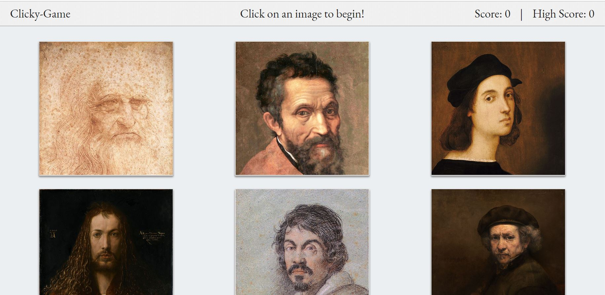

# Clicky-Game

## Overview
This is a memory click game build with React!
 
Users can click the artist images, try to not click on the same artist twice to increase your score.
 
Your high score will be reset after each session.
## Instructions
[Visit this link to try](https://kayleighs.github.io/Clicky-Game/)
 

### To Use
Click on an image to start!

 
## Built With
* node.js
* JavaScript
* HTML
* CSS
* [Bootstrap 4](https://getbootstrap.com/)-for CSS library
* [Create React App](https://github.com/facebook/create-react-app)-for React

## Author
* Kayleigh Starr